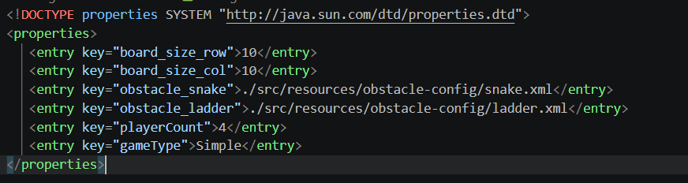
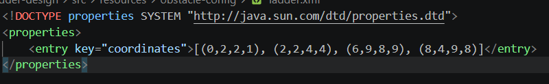
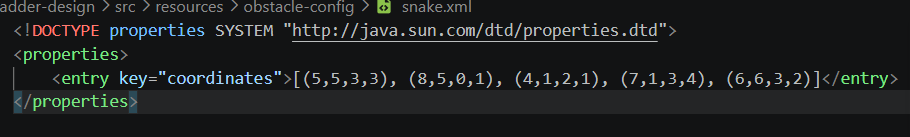

# SNAKE-LADDER LLD FOR INTERVIEW PRACTICE
This small project is my first serious attempt to practice LLD questions being asked in interviews. The total time it took to get the first iteration working was around 8hrs spanning across 2 weeks.

## PROBLEM STATEMENT
Design a snake and ladder game where given a *squared* size board, a certain no of players, a regular die and a certain no of obstacles(like snakes, ladders, teleporters etc) each with their own sort of *actions* when players encounter them, the players
start from their starting point and in round-robin manner take their turns to the roll the die and move their pieces. The 
player(s) who lands at the last grid position of the board is a winner.

## CONSTRAINTS
#### Board Size: 
Min and max size not enforced... i forgot lmao
#### Player count: 
Equal or greater than 4 players required for any game
#### Obstacles: 
Snakes and ladders are a must to play the game. Other obstacles can be configured if desired.
Snake's head coordinates must be greater than its tail. Vice-versa is true for ladder.
#### Die:
Regular die enforced
#### Player movement: 
...not serpentine just a regular left to right movement(yeah i know)
#### Configuration and input handling: 
The inputs like board size, player count, obstacles are configured in a `java.util.Properties` DTD-compliant XML file.

The coordinates for obstacles are enforced with a strict format [...(x1,y1,x2,y2)].
There is a main `config.xml` that contains the inputs for board size, player count and
other obstacle coordinates config location. The obstacle config files are also compliant to the same DTD schema as the main config. This file contains a single `<entry>` whose key always starts with `obstacle_` and then the type of the obstacle. The value of this entry
will be the coordinates expressed in the format mentioned earlier.

**NOTE: The type of the obstacle entered has to be present in the code to work.**

#### WIN CONDITION:
Player who reaches the last position on the board is the winner.

#### GAMEPLAY RULES:
Configurable ~~but not like in the config file~~. Each game has 3 stages; start, move and end. ~~Each of these stages can be configured as desired~~ Only start and move can be configured.

#### OUTPUT:
Ofc print the output to console in a readable manner. The output will be in the form of
`"stage: %s | player: %s | die_roll: %d | cell: %s | Obstacle: %s"` where each section
displays what it says except the `stage` section which is just another metadata to denote
a `BEFORE` and a `AFTER` stage, pre and post player movement on their turn.

## PROJECT STRUCTRE
Did not pay much time to project structure tbh. Since I come from enterprise developer background, you will see resemblance of
MVC pattern in this code and frankly that's how I wanted to start because I know it. Also, using *maven* might have been overkill for this but I remember wanting to use lombok but then decided to do it old-fashioned way.

## HOW TO BUILD/RUN
2 ways you can build and run this as of now:
- Use `./mvnw clean compile` to build and if you have this on vscode, use the *Run and debug* tab, select **App** profile and run.
- I have added the *maven-shade* plugin also if in case somebody wants to run it from a jar.
So just do `./mvnw clean package` to build and package into a fat jar and then run the jar using `java -jar path/to/jar/target/snake-ladder-design-1.0-SNAPSHOT.jar`.

**NOTE: JAVA 21 HAS TO BE PRESENT ON YOUR MACHINE**

## ENTITIES
Following are the domain objects in the `entities` folder: `Board`, `Cell`, `Die`, `Ladder`, `Obstacle`, `Player` and `Snake` each in their corresponding java files.

#### Let's talk about each of these:
- `Board`: Lives in `Board.java`. Is the root entity/domain of the game. Its only resonsibility is to create a 2d array of `Cell`s by taking the row and column size input
from the config.

- `Cell`: Lives in `Cell.java`. It resembles the grid position on a cartesian plane. Each cell contains an `Obstacle`. The reasoning to include an obstacle within a cell, was that I needed to know if a player has landed on a cell having it so that the player's position get changed according to the obstacle's action. Each cell also contains a member called `players` as a `Set<Player>` type reflecting multiple players in a cell. This was done to typically check the ending of the game, which is when any player could be at the last cell. The cell also implements a `Comparable` cuz I needed to it compare the cell coordinates when configuring the obstacles.

- `Die`: Lives in `Die.java`. Resembles a regular 6-faced die. Can be extended to create other complex types of dices but it won't matter right now cuz there is no factory for it.
It has 2 public methods; `void roll()` that generates a random integer b/w 1 and 6 to indicate a roll and a `int peek()` that returns the last rolled count.

- `Obstacle`: Lives in `Obstacle.java`. Is the abstract class for any obstacles like snake, ladder etc. Has an abstract method that subclasses need to implement called `Cell doAction(Cell)` and another called `void throwIfSpawnInvalid(Cell, Cell)` which is pretty self-explanatory. 

This method takes a single argument of type cell which generally denotes the cell at which obstacle was encountered and its upto the dev to mutate the current player's position by returning the new Cell value. As with the case with `Cell`, any obstacle has a starting cell and an ending cell.

- `Snake` and `Ladder`: Lives in `Snake.java` and `Ladder.java` respectively. Combining this 2 for brevity. Also pretty simple and self-explanatory. Do take a look into them.

- `Player`: Lives in `Player.java`. Is the domain model reflecting a player. Has member `name` that reflects the id of the player which is unique and dynamically hardcoded in a loop during its construction. Member `position` reflects the current position of player in the board as a type `Cell`. Other than the usual getters, setters and hashcode/equals overriding(will get into that too), the only real thing to poke at is the `void modifyPosition(Cell, Cell)` that mutates the player's position by taking 2 arguments of type `Cell` where 1st is the new position and 2nd old. As can be guessed, when a player's position changes, the player is deleted from the old cell and put into the new one.

- `Winner`: Lives in `Winner.java`. Is the domain model reflecting any winner of the game. The game allows for multiple winners. Has members `player` and `rollCount` reflecting the player of type `Player` who won and with what roll count.

## INVARIANTS:
Before going to the rest of the things, I wanted to put out the invariants that I have enforced in the game. This is mainly for myself because I want to get better at identifying invariants.
- `totalPlayersAllowed` value: In the abstract class `AbstractGameService`, you will see that in the constructor call I am doing a kind of input santitation by restricting the value to the maximum of total players in any game. This prevents the infinite loop condition where the game doesn't end because an invalid value was provided to the highlighted member. It also fails fast if the member value is in negatives or 0.

- `boolean end()` and `void markIfPlayerWon()` methods: In the same `AbstractGameService`, there are 2 final methods *end* and *markIfPlayerWon*. My reasoning was that since this is a snake and ladder game and typically in any such game, the game concludes when any player reaches the last cell on the board. As such, these 2 methods are marked invariant for devs because both of them mandate the end and win conditions to never change.

- Why `void next(Player)` and `int[] calcPosition()` aren't marked invariant?: Tbh i didn't really pay much attention to these as far as invariancy is concerned but now that I recall, I think I wanted to keep these 2 open in case something like skipping a player's turn if they are bit by a snake or if serpentine movement is required.

## GAME LOGIC:
- #### Configuration load:
When the app is run, the first thing it does is configure the game to be played. This
configuration is fetched from both `resources/config.xml` and the configs from `resources/obstacle-config/*`. The `config.xml` is the parent configuration file that is DTD-compliant with the `java.util.Properties` as mentioned before and the same goes for the obstacle configs. Below is the snippet of how both config.xml and any obstacle-config file should look
like:
##### Config.xml:

##### Ladder.xml

##### Snake.xml

As can be seen, there is a very specific format to the obstacle coordinates and it is enforced in code while parsing. If one requires to add a new obstacle, they have to follow this format. In addition, if one observes the coordinates themselves have to be feeded in such a way that the abstraction call to `void throwIfSpawnInvalid()` inside the `ObstacleFactory` succeeds without throwing. Again, this is upto the obstacle designer.

The entirety of configuration operation is handled by the class `Game` in `Game.java` during its instantiation. The flow of setup is as follows: `setupBoard(Properties)`->`setupObstacles(Properties)`->`setupPlayers(Properties)`->`setupDie(Properties)`->`setupGameType(Properties)`.

- #### Instantiation of `GameController` and `GameState`:
Once the game is configured with all the required entities, now comes the first step to run the game i.e. instantiating `GameController` in `GameController.java`. The GameController takes one constructor argument and that is of the type `AbstractGameService`. This abstraction in turn takes 3 constructor arguments i.e. `GameState` and `totalWinnersAllowed` and `totalPlayers`. Let's take a closer look into what each of these things mean:

**AbstractGameService** abstract class is the root contract to be implemented by any type of gameplay loop. What this means is that for any type of gameplay loop, a game service has to conform and implement this abstraction to have its distinct gameplay loop. The abstraction mandates 2 overrides; `boolean start()` which is used to indicate the start of a game loop once players start rolling the die from their **starting position**. The reasoning was that a game loop can be started when any no of parameters are met, which is thereby the decision of the implementor implementing the loop. This method has to return *true* boolean to indicate the controller, that the game has finally started. Eg: Players roll the die until they get a 6 to move from their starting point. And the last override to be made is the `Cell move(Player)` which is used to move the players themselves, returning their new mutated position. The reason to make *move* an abstraction was that each game loop type may require players to move in a certain way. Eg: In a serpentine game loop, players typically alternate their direction of movement at each row going from left->right, right->left, left->right... so on.

Now, lets talk about the constuctor arguments. As I said, each implementation of this abstraction needs to provide 3 constructor arguments. *`GameState` is the **source of truth** for any game loop. This is where things like the current player, the current die, the winners and the board is stored. By having this model, it becomes easier to make any decision about how to mutate a player's position or when to call it a win for a player. This is much better than making spaghetti calls to the different entities for a decision.
To add further, the **GameState** also in turn requires 3 constructor arguments i.e. `Board`, `Die` and the first `Player` who plays the turn. The board and die are crucial to keep the GameState valid so that every part of a players turn is validly captured.*

Next up is the `totalWinnersAllowed` which as it sounds is the count of how many maximum winners can there be in a game thereby ending the game loop. This has to be provided by the game loop type instance in its constructor call.

This brings us to the last argument; `totalPlayers`. This argument's value comes from the `config.xml` itself whose key is `playerCount`. During the instantiation of the game loop type, `totalWinnersAllowed` is normalized to always be within the limit of `totalPlayers` i.e. the former can never exceed the latter, which is reasonable.

Continuing on `GameController` post instantiation, the `void run()` method is the only method
responsible to run the game. Inside it you will find 2 loops, one as discussed is the loop execution until the players meet the required parameters of that loop type to, start the game indicated by the `start()` method. The next one after that is until the required no of winners are met indicated by the `end()` method, thereby ending the game and printing the winners to the console.

- #### How a player's position is mutated:
At each player's turn their current state is updated in the `GameState` which is majorly in this context is just the player who made the move itself. At each turn, the `GameController` calls the private method `void playTurn(Queue<Players>, Die)` which after doing some logic on removing players who may have won the game, calls the *invariant* implementation of the `final void next(Player)` in `AbstractGameService` taking the current player as its only argument. 

Inside, the method calls the loop type's implementation of the `Cell move(Player)` which itself calls the position calculation method called `int[] calcPosition(Player)` returning an array of 2 values, new X and new Y coordinates. The method then checks, if the new `Cell` has an obstacle. If so, mutates the player position according to that obstacle's action method. Otherwise mutates the position normally, given the player won't go out of bounds. Once, the `move` method returns with a `Cell`, the caller `next` updates the player position.

This encapsulation of *playTurn()->...next()->move(),update_position() and state_update()* keeps the movement logic in one place.

- #### How winners are tracked:
As mentioned, on each call of the `void playTurn(Queue<Players>, Die)` method at the end of it, the `AbstractGameService` instance calls the *invariant* `final void markIfPlayerWon()`.
This in turn, uses the `GameState` instance to find the current player, check if its `winner` flag is set to true and if so, add the player in the member `Set<Winner> winners` in `GameState`. Then, on the next turn of this player in the `playTurn` method its removed from the queue permanently. This also helps in keeping the `Player` memory footprint light.

#### That's pretty much about the game logic.

- #### Some side factory stuff:
I didn't want to use any DP for the sake of it and the one I did end up using is because it really felt to be more effective to use. So here are 2 of them; `ObstacleFactory` and `ServiceFactory`. `ObstacleFactory` is a factory to create any `Obstacle` type based on the configured obstacles in `resources/obstacle-config`. It has just 1 static method `Obstacle createObstacle(type, Cell, Cell)` that takes 3 args; `type` as the type of obstacle parsed from the config, the `start` coordinate and the `end` coordinate.

`ServiceFactory` is another factory to create any instance of the `AbstractGameService` which is configured in the root `config.xml` with the key `gameType`.

**NOTE: In both the factories if the type is not found, *UnsupportedOperationException* will be thrown.**

### ----------------------That's all for now. Thank you------------------------